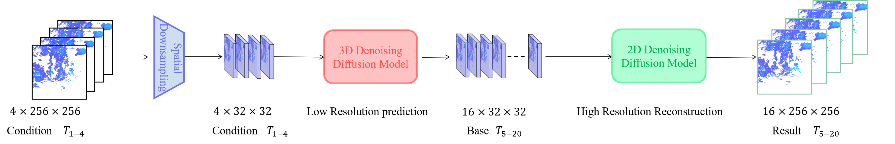
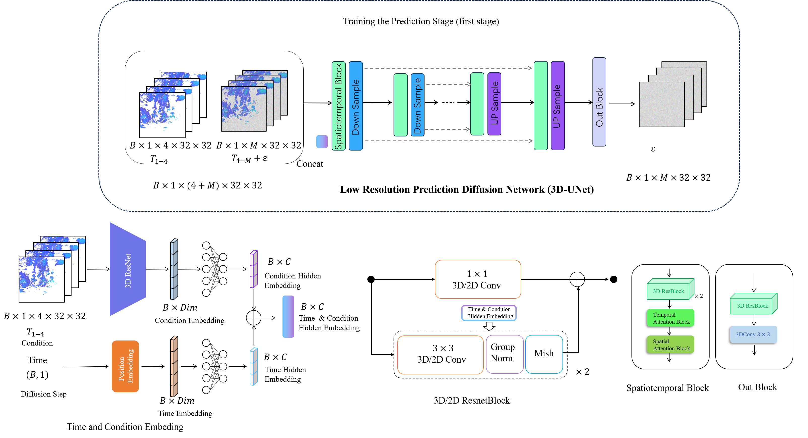
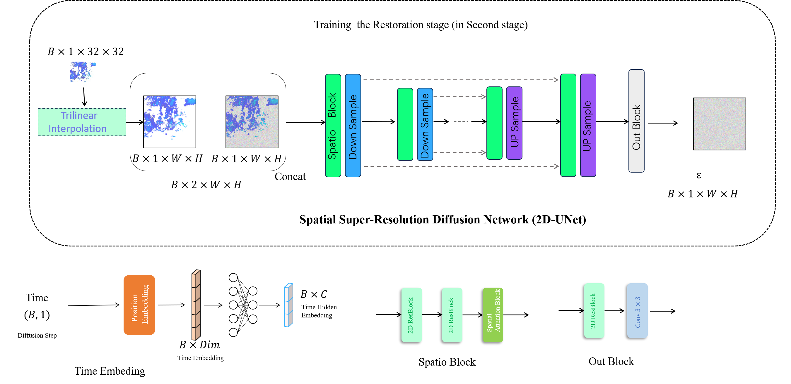

# Two-stage Diffusion Rainfall Forecasting Model

Deep neural networks have made great achieve- ments in rainfall prediction.However, the current forecasting methods have certain limitations, such as issues with blurry generated images and incorrect spatial positioning. To overcome these challenges, In this work, we propose a Two-Stage Diffusion Rainfall Prediction Model (TSDR) aimed at improving the accuracy of long-term rainfall forecasts and addressing the imbalance in performance between temporal and spatial modeling in deep models. In comparison to other methods, we have divided the rainfall prediction task into two stages. In essence, the primary objective of the first stage is to capture robust temporal information while preserving spatial information under low-resolution conditions. The task of the second stage is to reconstruct the low-resolution images generated in the first stage into high-resolution images.Our model demonstrates robust predictive capabilities on both the MRMS dataset and the Swedish radar dataset, outperforming methods.

# Our proposed method consists of two processes (models)

We will report our research methods and model structure, reasoning process, etc. in more detail here.

| Model | Learning Rate |Parameter |Optimizer|Epoch|
|---------|---------|---------|---------|---------|
| sequence diffusion|  1e-4  |  ???  |Adam|5000|
| SSR| 1e-4 |  ???  |Adam|5000|
| LSR| 1e-4 |  ???  |Adam|5000|

## Prediction stage

## Reconstruction stage

